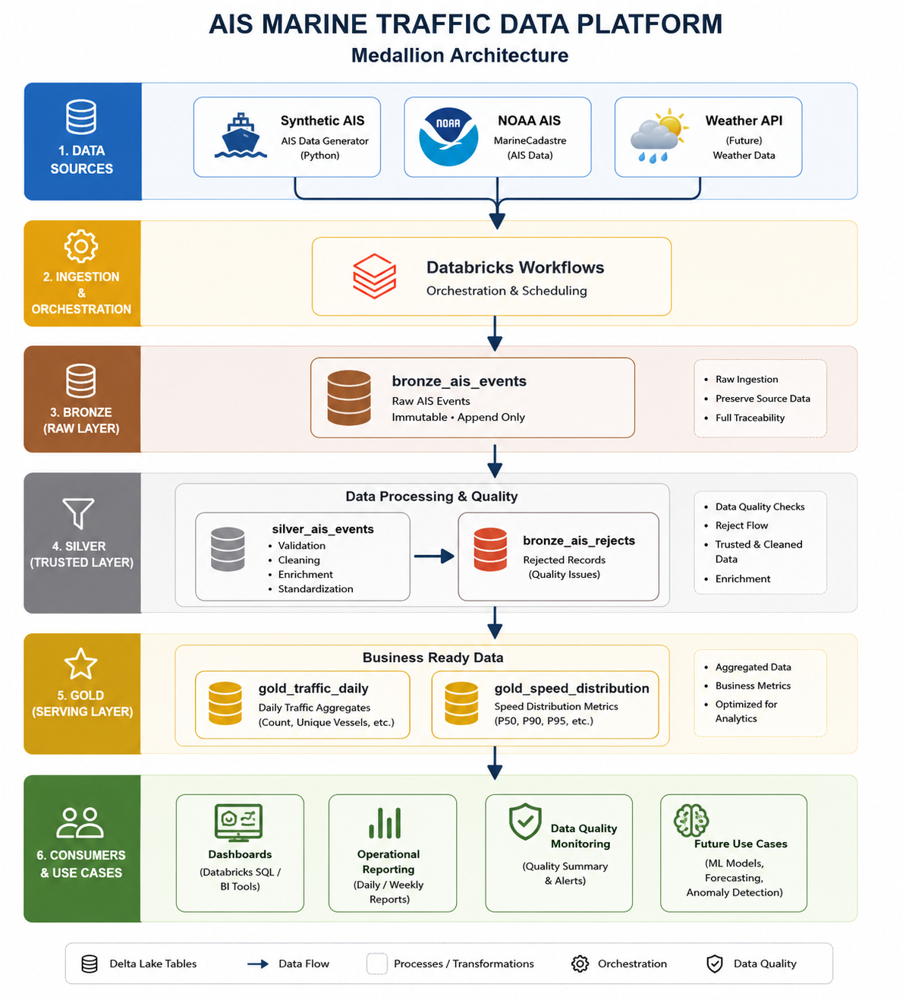

# maritime-traffic-intelligence-lakehouse

## Overview
An end-to-end lakehouse solution for maritime traffic analytics, transforming vessel movement data into trusted business-ready datasets and operational insights using Databricks, PySpark and Delta Lake.
## Business Problem
Maritime traffic generates large volumes of vessel movement data that must be ingested, validated and transformed before it can be used for operational reporting and analytics.

The objective of this project is to build a scalable data pipeline capable of processing vessel movement events, applying data quality controls, and serving business-ready datasets for traffic monitoring, congestion analysis and operational reporting.

## Architecture

The solution follows the Medallion Architecture pattern to transform raw maritime traffic data into trusted business-ready datasets.

### Data Flow

1. **Data Sources**

   * Synthetic AIS Generator
   * NOAA AIS (planned)
   * Weather API (future)

2. **Bronze Layer**

   * Stores raw AIS events.
   * Preserves source data without business transformations.
   * Includes audit metadata (`source_system`, `ingestion_timestamp`, `record_id`).

3. **Silver Layer**

   * Applies data quality validation.
   * Cleans and standardizes incoming data.
   * Routes invalid records into a dedicated reject table.
   * Produces trusted datasets for downstream analytics.

4. **Gold Layer**

   * Builds business-ready datasets.
   * Generates daily traffic metrics.
   * Produces vessel speed distribution analytics.

5. **Business Consumption**

   * Operational reporting
   * Dashboards
   * Data quality monitoring
   * Future analytics and machine learning use cases

## Key Data Engineering Concepts

This project demonstrates the implementation of several production-oriented Data Engineering concepts:

* Medallion Architecture (Bronze, Silver, Gold)
* Delta Lake storage
* Data Quality Validation
* Reject Record Handling
* Audit Metadata & Data Lineage
* Workflow Orchestration
* Business-ready Data Modeling
* Data Quality Monitoring

## Data Model

### Bronze Layer
Stores raw AIS-like vessel events enriched with audit metadata.

Main table:

- `bronze_ais_events`

Metadata columns:

- source_system
- ingestion_timestamp
- record_id
### Silver Layer
Applies data quality validations and business transformations.

Main table:

- `silver_ais_events`

Transformations:

Geographic coordinate validation
- Duplicate handling
- Event date extraction
- Event hour extraction
- Speed categorization
- Movement flag generation

Invalid records are redirected to:

- `bronze_ais_rejects`
### Gold Layer
Provides business-ready datasets and aggregated metrics.

Main tables:

- `gold_traffic_daily`
- `gold_speed_distribution`

Examples of generated metrics:

- Daily vessel activity
- Unique vessel counts
- Average vessel speed
- Speed category distribution
- Moving vs stationary vessel events
## Data Quality Framework
Invalid records are preserved in a dedicated reject table instead of being silently discarded, ensuring full traceability across the pipeline.

Current validation rules include:

- Invalid latitude detection
- Invalid longitude detection
- Missing vessel identifiers
- Missing event timestamps

Quality monitoring output:

- Bronze record count
- Silver record count
- Reject record count
- Gold record count
- Reject percentage

Example run:

- Bronze records: 50,000
- Silver records: 49,010
- Rejected records: 990
- Reject rate: 1.98%
## Workflow Orchestration
The pipeline is orchestrated using Databricks Jobs.

Execution flow:

1. Generate Sample Data
2. Bronze Processing
3. Silver Transformation
4. Gold Aggregations
5. Data Quality Validation
## Technologies Used

| Technology               | Purpose                                                                                                  |
| ------------------------ | -------------------------------------------------------------------------------------------------------- |
| **Databricks**           | Unified development environment for building, orchestrating and monitoring the data pipeline.            |
| **PySpark**              | Distributed data processing framework used for ingestion, transformations, validations and aggregations. |
| **Delta Lake**           | Storage layer providing ACID transactions, schema enforcement and reliable data management.              |
| **Databricks Workflows** | Orchestrates the execution of the end-to-end pipeline from data generation to quality validation.        |
| **GitHub**               | Version control and source code management using a feature branch workflow.                              |
| **Git**                  | Supports collaborative development through feature branches, commits and pull requests.                  |

## Project Structure

## How to Run

## Sample Results

## Roadmap

# Project Roadmap

This repository is intentionally designed as a long-term Data Engineering project that evolves alongside modern engineering practices.

Rather than building a one-off portfolio project, the objective is to progressively transform it into a production-grade data platform.

---

## Version 1.0 – Lakehouse MVP ✅

Completed

- Medallion Architecture
- Bronze / Silver / Gold layers
- Delta Lake tables
- Data Quality Framework
- Reject Record Handling
- Workflow Orchestration
- Architecture Documentation
- GitHub Repository

---

## Version 2.0 – Production Engineering 🚧

In Progress

- VS Code Development Environment
- Python Package Structure
- Modular Transformations
- Production Repository Layout
- Local Development Workflow

---

## Version 3.0 – Real Data Integration

Planned

- NOAA AIS Ingestion
- Multi-source Architecture
- Canonical Data Model
- Schema Mapping
- Data Contracts

---

## Version 4.0 – Advanced Lakehouse

Planned

- Incremental Processing
- Delta MERGE
- Partition Optimization
- Performance Tuning

---

## Version 5.0 – Production Platform

Planned

- Unit Testing
- CI/CD Pipeline
- Docker
- Infrastructure as Code
- Monitoring & Alerting
- Automated Deployments